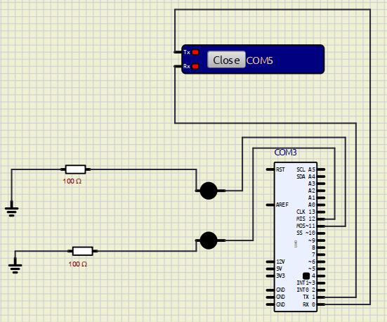

## Desenvolvedores
- Geovanna Silva Cunha - rm97736
- Victor Camargo Maciel - rm98384

# Detector de Postura com Alerta Visual

Um projeto simples que monitora a postura da cabeça usando MediaPipe e Arduino, alertando com LEDs quando o usuário inclina a cabeça para baixo (postura ruim).

**Ideal para quem passa muito tempo em frente do celular.**

## Funcionalidades

- Detecta inclinação da cabeça usando landmarks faciais (nariz e queixo).

- Feedback em tempo real:
    - LED verde: Postura correta.
    - LED vermelho: Postura ruim (cabeça inclinada).

- Exibe dados na tela: Diferença angular, tempo em postura ruim e status.

## Tecnologias e Dependências

**Python (MediaPipe)** 

`pip install matplotlib opencv-python notebook pyserial mediapipe`

**Arduino**
- Componentes:
    - 2 LEDs (verde e vermelho).
    - Resistores.
    - Jumpers.
    - Simulador de porta serial.

**Circuito Arduino (SimuIde)**
Exporte o arquivo (CIRC1.0CP2.sim1)
- Foram conectados os LEDs aos pinos digitais:
    - LED Verde: Pino 12 (+ resistor, terra).
    - LED Vermelho: Pino 11 (+ resistor, terra).
    - Simulador de Porta Serial (TX, RX).

    

## Carregando o Firmware no Arduino Virtual
**1. No Arduino IDE:**
- Abra seu código (postura_arduino.ino).
- Selecione a placa: Arduino Uno (COM5).
- Compile.
- Vá em Sketch → Exportar Binário Compilado (gera um arquivo .hex).

**2. No SimulIDE:**
- Clique com o botão direito no Arduino Uno.
- Selecione a COM > Carregar Firmware.
- Selecione o arquivo .hex gerado.

## Configuração da Porta Serial Virtual
**1. Abra o Simulador de Porta Serial instalado.**

**2. Crie um par de portas virtuais (ex: COM5 e COM6)**

**3. No SimulIDE:**
- Clique no Arduino → Propriedades.
- Em Porta Serial, selecione uma das portas criadas (ex: COM5).

**4. No código Python:**
```python
arduino = serial.Serial('COM6', 9600)  # Use a outra porta do par (COM5)
```

## Executando o Projeto
**1. Inicie a Simulação:**
- No SimulIDE, clique no botão Play.

**2. Execute o arquivo Python.**
- Verifique se os LEDs respondem no circuito virtual.

**3. Teste:**
- Movimente sua cabeça para baixo e volte a posição inicial (reta) frente à câmera.
- No SimulIDE:
    - LED verde deve acender para postura correta.
    - LED vermelho para postura inclinada.
